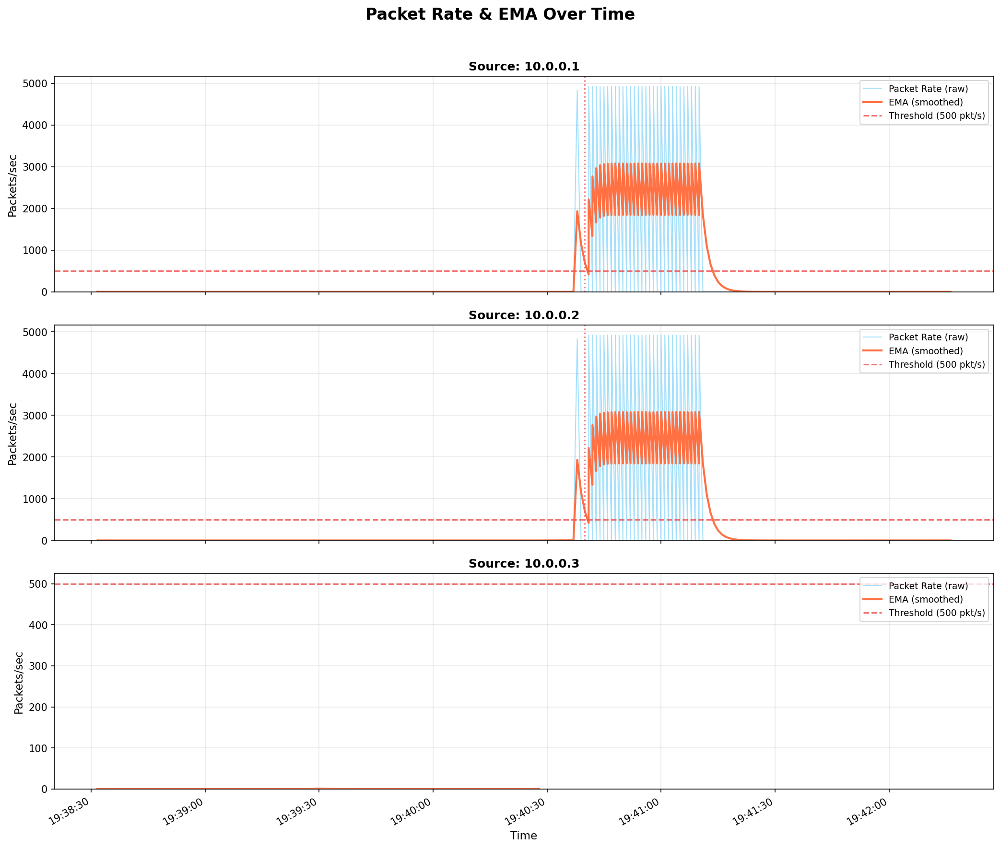
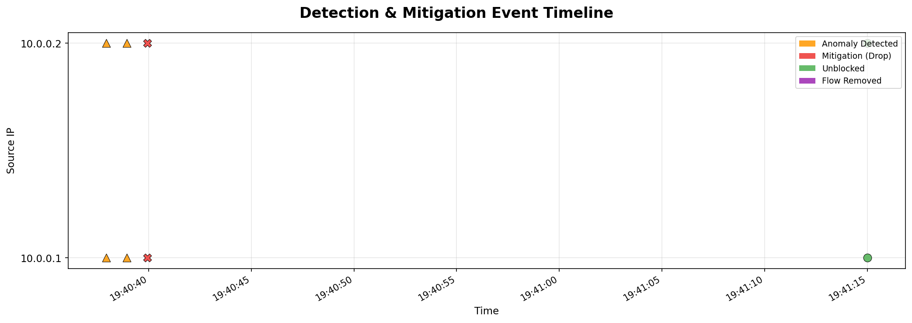
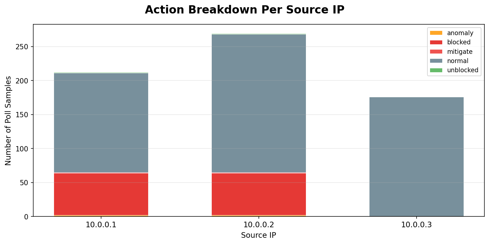

# SDN-Based Traffic Monitoring & Anomaly Mitigation

A Software-Defined Networking (SDN) system that monitors network traffic in real-time, detects anomalous flooding attacks using statistical analysis, and automatically mitigates threats by installing OpenFlow drop rules — all within a simulated Mininet environment.



---

## Architecture

```
┌──────────────┐     OpenFlow 1.3      ┌──────────────────────────┐
│   OVS Switch │◄──────────────────────►│   Ryu/OS-Ken Controller  │
│     (s1)     │   Flow Stats Polling   │   (ryu_controller.py)    │
└──────┬───────┘                        │                          │
       │                                │  • L2 Learning Switch    │
  ┌────┼────┐                           │  • EMA Anomaly Detection │
  │    │    │                           │  • Auto Mitigation       │
  h1   h2   h3                          │  • CSV Logging           │
  │    │    │                           └──────────────────────────┘
Attacker Victim Benign
```

- **h1 (10.0.0.1)** — Attacker host: generates flood traffic
- **h2 (10.0.0.2)** — Victim host: target of attacks
- **h3 (10.0.0.3)** — Benign host: normal background traffic

---

## Detection Algorithm

The controller uses a **threshold-based anomaly detector** with:

1. **Exponential Moving Average (EMA)** — Smooths per-source packet rates to reduce noise
2. **Hysteresis (Sustained Windows)** — Requires the EMA to exceed the threshold for N consecutive polling intervals before triggering mitigation, reducing false positives
3. **Automatic Recovery** — Drop rules include an `idle_timeout`, allowing blocked sources to resume communication after the attack stops

| Parameter | Default | Description |
|-----------|---------|-------------|
| `POLL_INTERVAL` | 1.0s | Flow stats polling frequency |
| `EMA_ALPHA` | 0.4 | EMA smoothing factor (0 < α ≤ 1) |
| `DETECTION_THRESHOLD` | 500 pkt/s | EMA threshold for anomaly |
| `SUSTAINED_WINDOWS` | 3 | Consecutive windows before mitigation |
| `MITIGATION_IDLE_TIMEOUT` | 30s | Drop rule auto-expiry |

---

## Results

From a sample run with ICMP flood attack from h1:

| Metric | Value |
|--------|-------|
| Detection Rate (Recall) | 100% |
| Detection Latency | 2.0s |
| Mitigation Latency | 2.0s |
| Recovery Time | 35.1s |
| Peak Attack Rate | 4,925 pkt/s |

### Generated Visualizations

|  |  |  |
|:---:|:---:|:---:|
| Packet Rate & EMA | Event Timeline | Action Breakdown |

---

## Prerequisites

- **OS**: Ubuntu 22.04+ (VM recommended for macOS/Windows users)
- **System packages**: `mininet`, `openvswitch-switch`, `iperf`, `hping3`, `python3-pip`
- **Python packages**: `os-ken` (or `ryu`), `matplotlib`

---

## Quick Start

### 1. Install Dependencies

```bash
sudo apt-get update
sudo apt-get install -y mininet openvswitch-switch iperf hping3 python3-pip
pip3 install -r requirements.txt
```

### 2. Run the Demo

```bash
sudo bash run_demo.sh
```

This automatically:
- Checks all prerequisites
- Starts the SDN controller
- Launches the Mininet topology
- Drops you into the Mininet CLI

### 3. Generate Traffic

From the `mininet>` prompt:

```bash
# Verify connectivity
pingall

# Start benign traffic
h2 iperf -s -u &
h3 iperf -c 10.0.0.2 -t 60 &

# Wait ~10 seconds for baseline, then launch attack
h1 ping -f 10.0.0.2 &

# Check flow table for drop rules
s1 ovs-ofctl dump-flows s1
```

### 4. Analyze Results

```bash
# After exiting Mininet
python3 analysis/plot_stats.py
python3 analysis/evaluate.py --attacker 10.0.0.1
```

Output files are saved to `logs/`.

---

## Project Structure

```
├── ryu_controller.py          # SDN controller (monitoring + detection + mitigation)
├── launch_controller.py       # Framework-agnostic launcher (ryu / os-ken)
├── topology.py                # Mininet topology (3 hosts + 1 OVS switch)
├── run_demo.sh                # Automated demo orchestration
├── requirements.txt           # Python dependencies
├── traffic/
│   ├── benign.sh              # Benign traffic generation commands
│   └── attack.sh              # Attack traffic generation commands
├── analysis/
│   ├── plot_stats.py          # Matplotlib visualizations
│   └── evaluate.py            # Evaluation metrics (precision, recall, latency)
├── logs/                      # Generated CSVs, plots, and reports
└── disc.md                    # Project approach document
```

---

## Configuration & Tuning

All detection parameters are configurable at the top of `ryu_controller.py`:

```python
POLL_INTERVAL = 1.0          # seconds between flow stats polls
EMA_ALPHA = 0.4              # EMA smoothing factor
DETECTION_THRESHOLD = 500.0  # packets/sec EMA threshold
SUSTAINED_WINDOWS = 3        # consecutive windows to trigger
MITIGATION_IDLE_TIMEOUT = 30 # drop flow auto-expiry (seconds)
```

**Calibration tip**: Run benign traffic first, observe the baseline EMA values in the CSV, and set `DETECTION_THRESHOLD` to ~2x the maximum benign EMA.

---

## Limitations & Future Work

- **Per-flow detection**: The current approach monitors flow stats per source IP. Flood traffic arriving at the victim can inflate the victim's counters, causing false positives. Port mirroring or ingress-only counters would address this.
- **Single threshold**: A fixed threshold may not adapt to varying network conditions. Future work could explore adaptive baselines or ML-based classifiers.
- **Single topology**: Tested with 1 switch, 3 hosts. Scaling to multi-switch topologies with distributed detection is left for future work.

---

## Safety & Ethics

⚠️ These scripts generate high-volume traffic within a **controlled local simulation**. Do NOT run attack commands (`hping3 --flood`, `ping -f`) against real production networks. This project is intended for **educational and research purposes only**.

---

## License

This project was developed as a university major project demonstrating SDN security concepts.